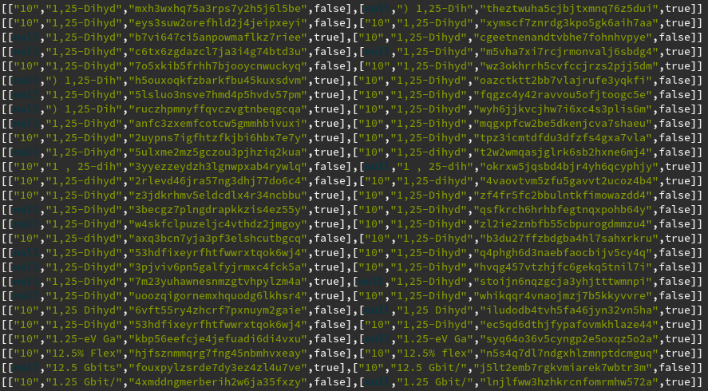

# skate

Key extractors and zipping tools.

Goal: make key extraction and comparisons fast for billions of records on a
single machine to support deduplication work for [fatcat](https://fatcat.wiki)
metadata.

## Problem

Handling a TB of JSON and billions of documents, especially for the following
use case:

* deriving a key from a document
* sort documents by (that) key
* clustering and verifing documents in clusters

The main use case is match candidate generation and verification for fuzzy
matching, especially for building a citation graph dataset from
[fatcat](https://fatcat.wiki).

